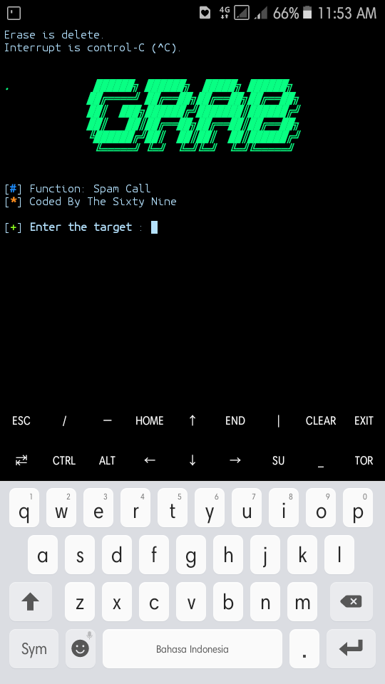

# Spamgarb

# Usage
```
pkg update && pkg upgrad
apt-get install git
apt-get install php
git clone https://github.com/thesixtynine/Spamgrab
cd Spamgra
ls
php grab.php
```
# Paypal:
https://www.paypal.com/cgi-bin/webscr?cmd=_s-xclick&hosted_button_id=CLKRT5QXXFJY4&source=url
# LiberaPay:
<noscript><a href="https://liberapay.com/thesixtynine/donate"></a></noscript>
